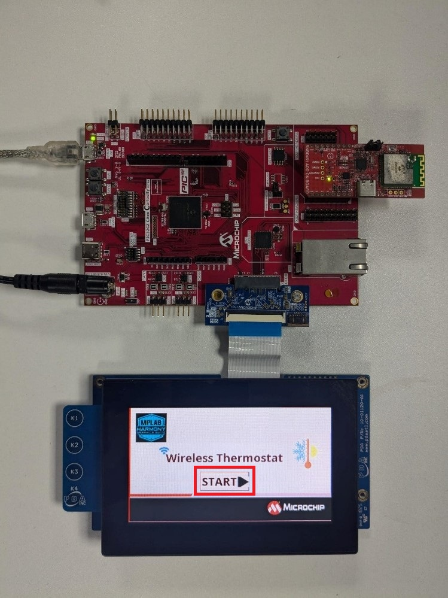
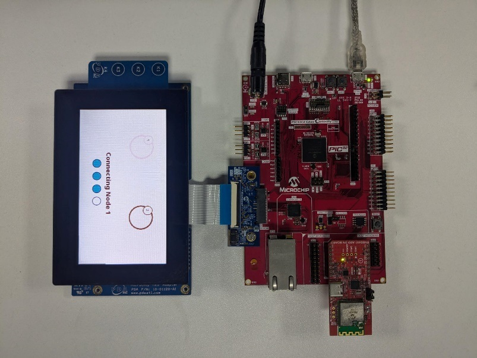

# Smart Wireless Thermostat BLE central application on PIC32CZ CA90 Curiosity Ultra Development Board

<h2 align="center"> <a href="https://github.com/Microchip-MPLAB-Harmony/reference_apps/releases/latest/download/pic32cz_ca90_cult_wireless_thermostat.zip" > Download </a> </h2>

## Description:

This project employs the RNBD451 BLE module to create multi-link BLE
connections with two peripheral nodes. Once connected, the central node
functions as a GATT client, periodically requesting real-time
temperature data from the peripheral GATT servers(peripherals) and
displaying it on a 4.3-inch max-touch graphics display. Users can set
and send temperature threshold limits to the BLE peripheral nodes using
the GUI. Furthermore, the central application transmits the gathered
temperature data to the WFI32 IoT gateway via UART for real-time
monitoring on the AWS cloud.

## Modules/Technology Used:

- Peripheral Modules

  - EVSYS

  - NVMCTRL

  - SERCOM 0 (I2C)

  - SERCOM 2(USART)

  - SERCOM 4 (USART)

  - Timers TCC0/TCC1/TCC9

- Graphics

  - EBI

  - I2C

  - LE LCC

  - Legato

  - Legato Graphics w/PDA TM430

  - Max-Touch Controller

  - PDATM4301B

  - GFX Core LE

- System Services

  - Time

- Input

  - Input System Service

- Wireless driver

  - RNBD BLE driver

- BSP

  - PIC32CZ CA90 Curiosity Ultra BSP

- Harmony Core service

 

 

## Hardware Used:

- [PIC32CZ CA90 Curiosity Ultra Development
  Board](https://www.microchip.com/en-us/development-tool/ev16w43a)

- [RNBD451 Add-on
  Board](https://www.microchip.com/en-us/development-tool/EV25F14A)

- [4.3” WQVGA maXTOUCH Display
  module](https://www.microchip.com/en-us/development-tool/AC320005-4)

- [565 LCD Adapter Graphics Card](https://www.microchip.com/en-us/development-tool/ac320212)  

## Software/Tools Used:

The projects have been verified to work with the following versions of
software tools:

- **For Central PIC32CZ_CA90 BLE GATT Client**, refer [Project Manifest](./src/config/pic32cz_ca90_cult/harmony-manifest-success.yml) present in the [project folder](./src/config/pic32cz_ca90_cult)

- [MPLAB® X IDE
  v6.20](https://www.microchip.com/en-us/tools-resources/develop/mplab-x-ide#tabs)

- [MPLAB® XC32 C/C++ Compiler
  v4.45](https://www.microchip.com/en-us/tools-resources/develop/mplab-xc-compilers/xc32#downloads)

- Python 3.5 or higher.

Because Microchip regularly updates tools, occasionally issue(s) could
be discovered while using the newer versions of the tools. If the
project doesn’t seem to work and version incompatibility is suspected,
it is recommended to double-check and use the same versions that the
project was tested with. To download original version of MPLAB® Harmony
v3 packages, refer to document [How to Use the MPLAB® Harmony v3 Project
Manifest
Feature](https://ww1.microchip.com/downloads/en/DeviceDoc/How-to-Use-the-MPLAB-Harmony-v3-Project-Manifest-Feature-DS90003305.pdf)

## Hardware Setup:

**PIC32CZ CA90 Thermostat Central node:**

- Connect the **RNBD451 Add-on board** to the **mikroBUS** header on the **PIC32CZ CA90 Curiosity Ultra Development Board**. 

- Make sure the jumper **J2** of the **RNBD451 Add-on board** has the cap mounted between **J(2-1)** and **J(2-2)** to be powered by the **mikroBUS**
  header.

- Connect the **565 LCD Adapter Graphics Card** to the "**Graphics connector**" of the **PIC32CZ CA90 Curiosity Ultra Development Board**.

- Connect the **4.3” WQVGA maXTOUCH Display module** to the Graphics interface of the PIC32CZ CA90 Curiosity Ultra Development Board.

- Connect the jumper wire from pin **PC08** on **EXT1** for **SERCOM UART TX** to
  communicate with the WFI32 IoT board.

- Connect the **PIC32CZ CA90 Curiosity Ultra Development Board** to the **Host PC**
  as a USB Device through a **Type-A male to micro-B USB** cable connected
  to **Micro-B USB (Debug USB)** port.

- Power the PIC32CZ CA90 Curiosity Ultra Development Board through the **Barrel connector** using the **wall-mount 9V power supply** 
  provided in the kit, or Power supply with any Voltage (**6.5-14V DC**) and Current (**> 750 mA**) range.

 

## Programming prebuilt hex file:

- Open MPLAB® X IDE.

- Close all existing projects in IDE, if any project is opened.

- Go to **File** -> **Import** -> **Hex/ELF** File.

- In the "**Import Image File**" window, Step 1 - Create Prebuilt Project,
  Click the "**Browse**" button to select the prebuilt hex file.

- Select Device as "**PIC32CZ8110CA90208**"

- Ensure the proper tool is selected under "**Hardware Tool**".

- Click on the "**Next**" button.

- In the "**Import Image File**" window, Step 2 - Select Project Name and
  Folder, select appropriate project name and folder.

- Click on the "**Finish**" button.

- In MPLAB® X IDE, click on "**Make and Program Device**" Button. The device
  gets programmed.

- Follow the steps in Running the Demo.

## Programming by building the application project:

### Programming/Debugging Application Project:

- Open the project **pic32cz_ca90_cult.X** in MPLAB® X IDE from [here](.) and set
  as main project.

- Ensure "**PIC32CZ CA90 Curiosity Ultra**" is selected as hardware tool to
  program/debug the application

- Build the code and program the device by clicking on the "**Make and
  Program Device**" button in MPLAB® X IDE tool bar

- Follow the steps in Running the Demo as below.

**Running the Demo:**

- Power up the board.

**<u>Screen 1: Home Screen</u>**

- The home screen of the demo gets displayed on the Graphics display
  panel.

> Make sure the BLE peripheral nodes are
  already programmed with their respective application projects and both
  the nodes are ready to connect to the central node.The
  following console message will be displayed after programming the firmware into **PIC32CM LS60 Curiosity Pro kit** and
  **WBZ451 Curiosity Developemnet** boards in their tera term consoles.

> 
 Node 1 Advertising and waiting for connection
> 
  style="width:3.84901in;height:2.03677in" />

> 
 Node 2 Advertising and waiting for connection
> 
  style="width:5.87582in;height:0.79178in" />

> ***Note: The pic32cz_ca90_cult.X project does not have any console messages***

- Press the “**Start**” button on the home screen.

> 
 style="width:4.14444in;height:5.10833in" />
>
> **<u>Screen 2: Multi-connect screen</u>**

- The central node starts to scan for the peripheral nodes.
  “**Scanning**” appears on the connect screen. Please wait for a few
  seconds for the BLE scanning process to complete.

- Once the scanning completes, the central initiates connection with BLE
  Node 1.

> 
  style="width:3.65in;height:4.74091in" />

- Once the peripheral node 1 connects to the central, a **tick mark
  appears** on the GUI as below and **LED0 is turned on**.

> 
  style="width:4.23636in;height:5.17727in" />

- Similarly, the central node initiates another connection with BLE
  sensor node 2.

- Upon successfully connecting with the second node, a tick mark appears
  on the GUI and the GUI next screen appears.

- **LED0** and **LED1** are turned on with a successful multilink connection on
  the PIC32CZ CA90 Curiosity Ultra Development Board as below

> 
  style="width:4.46108in;height:3.34375in" />

**<u>Screen 3: Multi node Temperature monitoring</u>**

- This screen gets updated with node 1 and node 2 temperature data
  fetched in periodic intervals from the BLE peripheral devices.

 

- Press “**Set Limit**” button to assign threshold limit for the nodes
  to cutoff the heating or cooling unit. Once Set Limit is pressed the
  next screen appears.

**<u>Screen 4: Temperature Control</u>**

- Temperature limits can be set for each of the nodes using the ‘**ᴧ**’
  (Increment) and ‘**v**’(Decrement) buttons.

- To set threshold for node 1, adjust the temperature and press “**enter**”.

- Similarly, to set threshold for node 2, adjust the temperature for
  node 2 and press “**enter**”.

> **Note:** Please note that the limits for each node should be set
> individually. The nodes do not get updated simultaneously. To set
> threshold for both the nodes, change the limit in one node, press
> "**enter**" and then do the same for the other node.

- Press “**Press to Go back**” to go to screen 3.

 

## Comments:

- [Getting Started Extended Application on PIC32CZ CA90 Curiosity Ultra
  Development
  Board](https://microchip-mplab-harmony.github.io/reference_apps/apps/pic32cz_ca90_cult/pic32cz_ca90_getting_started_ext/readme.html)

- [Creating the First Application on PIC32CZ CAx Microcontrollers Using
  MPLAB® Harmony v3 with MPLAB® Code Configurator
  (MCC)](https://ww1.microchip.com/downloads/aemDocuments/documents/MCU32/ProductDocuments/SupportingCollateral/Creating-the-First-Application-on-PIC32CZ-CAx-Microcontrollers-Using-MPLAB-Harmony-v3-with-MPLAB-Code-Configurator-DS90003348.pdf)

<!-- -->

- This application demo builds and works out of box by following the
  instructions above in [Running the demo ](#Runningthedemo)section. If
  there is a need to enhance/customize this application demo, use
  the MPLAB® Harmony v3 Software framework. Refer links below to setup
  and build the applications using MPLAB® Harmony v3.

  - [How to Setup MPLAB® Harmony v3 Software Development
    Framework](https://ww1.microchip.com/downloads/en/DeviceDoc/How_to_Setup_MPLAB_%20Harmony_v3_Software_Development_Framework_DS90003232C.pdf)

  - [How to Build an Application by Adding a New PLIB, Driver, or
    Middleware to an Existing MPLAB® Harmony v3
    Project](http://ww1.microchip.com/downloads/en/DeviceDoc/How_to_Build_Application_Adding_PLIB_%20Driver_or_Middleware%20_to_MPLAB_Harmony_v3Project_DS90003253A.pdf)

  - **MPLAB® Harmony v3 is also configurable through MPLAB® Code
    Configurator (MCC). Refer to the below links for specific
    instructions to use MPLAB® Harmony v3 with MCC.**

    - [Create a new MPLAB® Harmony v3 project using
      MCC](https://microchipdeveloper.com/harmony3:getting-started-training-module-using-mcc)

    - [Update and Configure an Existing MHC-based MPLAB® Harmony v3
      Project to MCC-based
      Project](https://microchipdeveloper.com/harmony3:update-and-configure-existing-mhc-proj-to-mcc-proj)

    - [Getting Started with MPLAB® Harmony v3 Using MPLAB® Code
      Configurator](https://www.youtube.com/watch?v=KdhltTWaDp0)

    - [MPLAB® Code Configurator Content Manager for MPLAB® Harmony v3
      Projects](https://www.youtube.com/watch?v=PRewTzrI3iE)

## Revision: