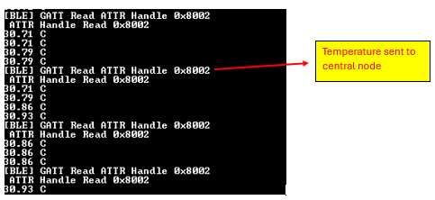
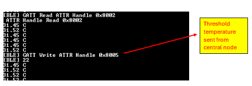
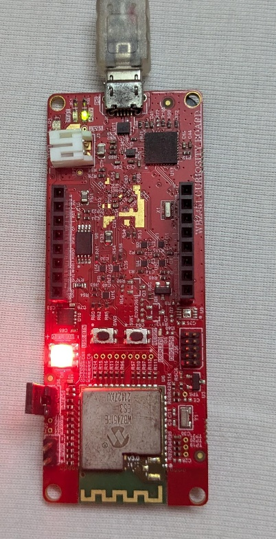

# Smart Wireless Thermostat BLE peripheral application on WBZ451 Curiosity Development Board
<h2 align="center"> <a href="https://github.com/Microchip-MPLAB-Harmony/reference_apps/releases/latest/download/pic32cz_ca90_cult_wireless_thermostat.zip" > Download </a> </h2>

## Description:

This application uses ADC to read the analog output from the onboard
MCP9700A temperature sensor. Once connected to central node over BLE, it
periodically sends the temperature characteristic value to the central
node upon request. It can also receive and set threshold limit values
from the central node, with an onboard LED illuminating when the
temperature surpasses the defined cutoff.

## Modules/Technology Used:

- Peripheral Modules

  - ADCHS

  - EVSYS

  - NVM

  - RTC

  - SERCOM 0 (USART)

  - TC

- Libraries

  - Cryptographic (Crypto) Library

- System Services

  - CONSOLE

- Third Party Libraries

  - RTOS

  - wolfCrypt Library

- Wireless Drivers

  - BLE

    - BLE Stack

  - Services

    - Customized Service

  - PIC32CX-BZ System Services

    - Device_Support

    - PDS_SubSystem

- BSP

  - WBZ451 Curiosity BSP

- Harmony Core service

> 
  alt="A black screen with white text Description automatically generated" />

## Hardware Used:

- [WBZ451 Curiosity Development
  Board](https://www.microchip.com/en-us/development-tool/ev96b94a)

## Software/Tools Used:

The projects have been verified to work with the following versions of
software tools:

- **For peripheral WBZ451 GATT server**, Refer [Project manifest](./src/config/pic32cxbz2_wbz451_curiosity/harmony-manifest-success.yml) 
  present in the [project folder](./src/config/pic32cxbz2_wbz451_curiosity)

- [MPLAB® X IDE
  v6.20](https://www.microchip.com/en-us/tools-resources/develop/mplab-x-ide#tabs)

- [MPLAB® XC32 C/C++ Compiler
  v4.45](https://www.microchip.com/en-us/tools-resources/develop/mplab-xc-compilers/xc32#downloads)

- Tera Term or any serial application

Because Microchip regularly updates tools, occasionally issue(s) could
be discovered while using the newer versions of the tools. If the
project doesn’t seem to work and version incompatibility is suspected,
it is recommended to double-check and use the same versions that the
project was tested with. To download original version of MPLAB® Harmony
v3 packages, refer to document [How to Use the MPLAB® Harmony v3 Project
Manifest
Feature](https://ww1.microchip.com/downloads/en/DeviceDoc/How-to-Use-the-MPLAB-Harmony-v3-Project-Manifest-Feature-DS90003305.pdf)

## Hardware Setup:

**WBZ451 Thermostat Peripheral Node 2**

- Connect the **WBZ451 Curiosity Development Board** to the **Host PC** as a USB Device
  through a **Type-A male to micro-B USB** cable connected to **Micro-B Debug USB port(J7)**.

## Programming prebuilt hex file:

- Open MPLAB® X IDE.

- Close all existing projects in IDE, if any project is opened.

- Go to **File** -> **Import** -> **Hex/ELF** File.

- In the "**Import Image File**" window, Step 1 - Create Prebuilt Project,
  Click the "**Browse**" button to select the prebuilt hex file.

- Select Device as "**WBZ451**”

- Ensure the proper tool is selected under "**Hardware Tool**".

- Click on the "**Next button**".

- In the "**Import Image File**" window, Step 2 - Select Project Name and
  Folder, select appropriate project name and folder.

- Click on the "**Finish button**".

- In MPLAB® X IDE, click on "**Make and Program Device**" Button. The device
  gets programmed.

- Follow the steps in [Running the Demo](#running-the-demo).

## Programming/Debugging application project:

- Open the project **wbz451_curiosity.X** in MPLAB® X IDE from [here](.)

- Ensure "**WBZ451 Curiosity board**" is selected as hardware tool to
  program/debug the application

- Build the code and program the device by clicking on the "**Make and Program Device**" button in MPLAB® X IDE tool bar

- Follow the steps in [Running the Demo ](#running-the-demo)

## Running the Demo:

**WBZ451 BLE peripheral node:**

- Power up the board.

- Open the Terminal application (Ex.:Tera term) on the computer.

- Change the baud rate to 115200.

> 
  style="width:2.65823in;height:2.56529in"
> alt="A screenshot of a computer Description automatically generated" />

- Press **RESET** button to start over the application.

- The device starts BLE advertisement and displays the current
  temperature in periodic intervals

> 
  style="width:5.27848in;height:1.52888in"
> alt="A screen shot of a computer Description automatically generated" />

- Once the connection with the central node is successful, it sends the
  current temperature value to the central. The updated temperature can
  be seen on screen 3 of the central node’s GUI.

> 
  style="width:5.8936in;height:1.02396in"
> alt="A black screen with white text Description automatically generated" /> style="width:5.82279in;height:2.70886in"
> alt="A black background with white letters Description automatically generated" />

- The BLE node also receives the temperature threshold values set on the
  central node

> 
   style="width:6.65764in;height:2.27222in"
>  alt="A black background with white text and red line Description automatically generated" />
  
 - The RGB LED(**D6**) glows in Red when the current temperature exceeds the
  threshold set. In the above image the current temperature (31°C) is
  greater than the received threshold (22°C). The LED turns on in this
  scenario as in the below image.

> 
  style="width:1.81235in;height:3.5443in"
> alt="A red circuit board with a red light Description automatically generated" />

## Comments:

- [PIC32CXBZ2 Application Developer's
  Guide](https://onlinedocs.microchip.com/oxy/GUID-A5330D3A-9F51-4A26-B71D-8503A493DF9C-en-US-7/GUID-7663617B-0DD1-45FA-86B5-EB0778A5A424.html)

- [PIC32CXBZ2 - MPLAB Harmony Wireless BLE
  Userguide](https://onlinedocs.microchip.com/oxy/GUID-C5EAF60E-9124-427C-A0F1-F2DBE662EA92-en-US-3/index.html)

- [PIC32CXBZ2-Programming
  specification](https://ww1.microchip.com/downloads/aemDocuments/documents/WSG/ProductDocuments/ProgrammingSpecifications/PIC32CX-BZ2-Programming-Specification-DS70005461.pdf)

- This application demo builds and works out of box by following the
  instructions above in [Running the demo ](#running-the-demo)section.
  If there is a need to enhance/customize this application demo, use the MPLAB® Harmony v3 Software framework. Refer links below to
  setup and build the applications using MPLAB® Harmony.

  - [How to Setup MPLAB® Harmony v3 Software Development
    Framework](https://ww1.microchip.com/downloads/en/DeviceDoc/How_to_Setup_MPLAB_%20Harmony_v3_Software_Development_Framework_DS90003232C.pdf)

  - [How to Build an Application by Adding a New PLIB, Driver, or
    Middleware to an Existing MPLAB® Harmony v3
    Project](http://ww1.microchip.com/downloads/en/DeviceDoc/How_to_Build_Application_Adding_PLIB_%20Driver_or_Middleware%20_to_MPLAB_Harmony_v3Project_DS90003253A.pdf)

  - **MPLAB® Harmony v3 is also configurable through MPLAB® Code
    Configurator (MCC). Refer to the below links for specific
    instructions to use MPLAB® Harmony v3 with MCC.**

    - [Create a new MPLAB® Harmony v3 project using
      MCC](https://microchipdeveloper.com/harmony3:getting-started-training-module-using-mcc)

    - [Update and Configure an Existing MHC-based MPLAB® Harmony v3
      Project to MCC-based
      Project](https://microchipdeveloper.com/harmony3:update-and-configure-existing-mhc-proj-to-mcc-proj)

    - [Getting Started with MPLAB® Harmony v3 Using MPLAB® Code
      Configurator](https://www.youtube.com/watch?v=KdhltTWaDp0)

    - [MPLAB® Code Configurator Content Manager for MPLAB® Harmony v3
      Projects](https://www.youtube.com/watch?v=PRewTzrI3iE)

## Revision: