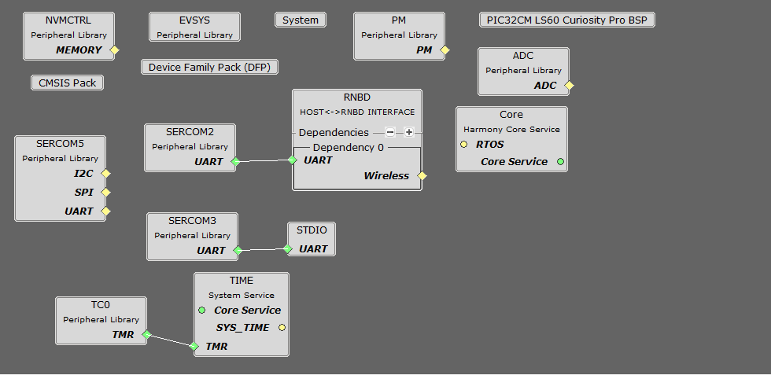

# Smart Wireless Thermostat BLE peripheral application on PIC32CM LS60 Curiosity Pro Evaluation Kit

<h2 align="center"> <a href="https://github.com/Microchip-MPLAB-Harmony/reference_apps/releases/latest/download/pic32cz_ca90_wireless_thermostat.zip" > Download </a> </h2>

## Description:

This application operates as a GATT server using the RNBD451 BLE module.
It periodically collects temperature data from the IO/1 Xplained Pro
board and updates the temperature characteristic value whenever the
temperature changes. The node waits for the connection request from the
central node. Once connected, it sends temperature data in response to
read requests from the GATT client(central node) and can receive and
implement threshold limit values from the central node. An onboard LED
turns on whenever the current temperature exceeds the designated limit.

## Modules/Technology Used:

- Peripheral Modules (Secure)
  - EVSYS
  - NVMCTRL
  - PM
  - RTC

- Peripheral Modules (Non- Secure)
  - ADC
  - SERCOM 2 (UART)
  - SERCOM 3 (UART)
  - SERCOM 5 (I2C)
  - TC

- System Services
  - Time

- Wireless driver
  - RNBD BLE driver

- Harmony Core Service

 

## Hardware Used:

- [PIC32CM LS60 Curiosity Pro Evaluation
  Kit](https://www.microchip.com/en-us/development-tool/EV76R77A)
- [RNBD451 Add-on
  Board](https://www.microchip.com/en-us/development-tool/EV25F14A)
- [I/O1 Xplained Pro Extension
  Kit](https://www.microchip.com/Developmenttools/ProductDetails/ATIO1-XPRO)

## Software/Tools Used:

The projects have been verified to work with the following versions of
software tools:

- **For peripheral PIC32CM_LS60 BLE GATT server** , refer to the [Secure Project Manifest](../pic32cm_ls60_cpro_wt_node1_secure/src/config/ls60_cpro/harmony-manifest-success.yml) and [Non-Secure Project Manifest](./src/config/ls60_cpro/harmony-manifest-success.yml) of Secure
  and Non-Secure projects respectively.
- [MPLAB® X IDE
  v6.20](https://www.microchip.com/en-us/tools-resources/develop/mplab-x-ide#tabs)
- [MPLAB® XC32 C/C++ Compiler
  v4.45](https://www.microchip.com/en-us/tools-resources/develop/mplab-xc-compilers/xc32#downloads)
- Tera term or any serial console application

Because Microchip regularly updates tools, occasionally issue(s) could
be discovered while using the newer versions of the tools. If the
project doesn’t seem to work and version incompatibility is suspected,
it is recommended to double-check and use the same versions that the
project was tested with. To download original version of MPLAB® Harmony
v3 packages, refer to document [How to Use the MPLAB® Harmony v3 Project
Manifest
Feature](https://ww1.microchip.com/downloads/en/DeviceDoc/How-to-Use-the-MPLAB-Harmony-v3-Project-Manifest-Feature-DS90003305.pdf)

## Hardware Setup:

#### PIC32CM LS60 Thermostat Peripheral Node 1:

- Connect the **RNBD Add-on board** to the **mikroBUS** header on the **PIC32CM
  LS60 Curiosity Pro Evaluation Kit**. 
  
- Make sure the jumper **J2** of the **RNBD451 Add-on board** has the cap mounted between **J(2-1)** and **J(2-2)** to be powered by the mikroBUS header.

- Connect the **I/O1 Xplained Pro Extension Kit** to the **EXT2** in the **PIC32CM
  LS60 Curiosity Pro Evaluation Kit**.

- Connect the **PIC32CM LS60 Curiosity Pro Evaluation Kit** to the **Host PC**
  as a USB Device through a **Type-A male to micro-B USB** cable connected
  to **Micro-B USB (Debug USB)** port

 

## Programming prebuilt hex file:

- Open MPLAB® X IDE.

- Close all existing projects in MPLAB® X IDE, if any project is opened.

- Go to **File** -> **Import** -> **Hex/ELF** File.

- In the "**Import Image File**" window, Step 1 - Create Prebuilt Project,
  Click the "**Browse**" button to select the prebuilt hex file.

- Select Device as "**PIC32CM5164LS60100**”

- Ensure the proper tool is selected under "**Hardware Tool**".

- Click on the **Next** button.

- In the "**Import Image File**" window, Step 2 - Select Project Name and
  Folder, select appropriate project name and folder.

- Click on the **Finish** button.

- In MPLAB® X IDE, click on "**Make and Program Device**" Button. The device
  gets programmed.

- Follow the steps in [Running the Demo](#Runningthedemo).

## Programming/Debugging Application Project:
 
- Open the project **ls60_cprogroup.X** from [here](.) in MPLAB® X
  IDE.

- Open both Secure and Nonsecure projects inside the project group and
  set the Nonsecure as the main project.

- Ensure "**PIC32CM LS60 Curiosity Pro**" is selected as hardware tool to
  program/debug the application.

- Build the code and program the device by clicking on the "**Make and Program Device**" button in MPLAB® X IDE tool bar.

- Follow the steps in [Running the Demo ](#Runningthedemo)

 

## Running the Demo:

#### PIC32CM LS60 BLE Peripheral Node:

- Power up the board.

- Open the Terminal application (Ex.:Tera term) on the computer.

- Change the baud rate to 115200 from **Setup**->**Serial** menu.

>
  style="width:3.3494in;height:3.2323in" />

- Press **RESET** button to run the application from the beginning.

- The below console output will be displayed. The last message on Tera Term will be
  “**Connecting**” where the node waits for a BLE connection.

 

- When the central node successfully connects, the green **LED0** turns on
  indicating successful connection.

 

- The measured temperature value prints on the console as below. Please
  note that the temperature value prints only when the temperature
  changes.

 

- The BLE node also receives the temperature threshold values set on the
  central node as below.

 

- **LED1** (Red LED) turns on whenever the current measured temperature is
  greater than the limit set on the GUI.

 

## Comments:

- [Getting Started with the PIC32CM LE00/LS00/LS60 Curiosity Pro Board](https://ww1.microchip.com/downloads/aemDocuments/documents/MCU32/ApplicationNotes/ApplicationNotes/AN4511-Getting-Started-with-the-PIC32CM-LE00-LS00-LS60-Curiosity-Pro-Board-DS00004511.pdf)
- Reference Document: [PIC32CM LS00/LS60 Security Reference
  Guide](https://ww1.microchip.com/downloads/aemDocuments/documents/MCU32/ApplicationNotes/ApplicationNotes/AN3992-PIC32CM-LS00-LS60-Security-Reference-Guide-DS00003992.pdf)
- This application demo builds and works out of box by following the instructions above in [Running the Demo ](#running-the-demo)section. If there is a need to enhance or customize this application demo, use the MPLAB® Harmony v3 Software framework. Refer to the links below to set up and build the applications using MPLAB® Harmony v3.
	- [How to Setup MPLAB Harmony v3 Software Development Framework](https://ww1.microchip.com/downloads/aemDocuments/documents/MCU32/ProductDocuments/SupportingCollateral/How-to-Setup-MPLAB-Harmony-v3-Software-Development-Framework-DS90003232.pdf)	
	- [Video - How to Set up the Tools Required to Get Started with MPLAB® Harmony v3 and MCC](https://www.youtube.com/watch?v=0rNFSlsVwVw)	
	- [Create a new MPLAB Harmony v3 project using MCC](https://developerhelp.microchip.com/xwiki/bin/view/software-tools/harmony/getting-started-training-module-using-mcc/)
	- [Update and Configure an Existing MHC-based MPLAB Harmony v3 Project to MCC-based Project](https://developerhelp.microchip.com/xwiki/bin/view/software-tools/harmony/update-and-configure-existing-mhc-proj-to-mcc-proj/)
	- [How to Build an Application by Adding a New PLIB, Driver, or Middleware to an Existing MPLAB Harmony v3 Project](https://ww1.microchip.com/downloads/aemDocuments/documents/MCU32/ProductDocuments/SupportingCollateral/How-to-Build-an-Application-by-Adding-a-New-PLIB-Driver-or-Middleware-to-an-Existing-MPLAB-Harmony-v3-Project-DS90003253.pdf)	
	  
##   Revision:
- v1.7.0 - Released demo application

