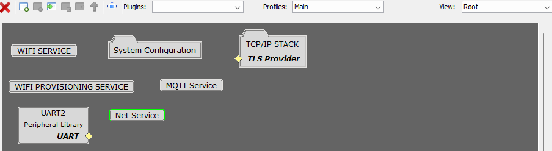
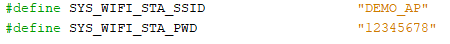
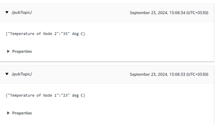

# Smart Wireless Thermostat Wi-Fi Gateway application on WFI32 IoT Development Board
<h2 align="center"> <a href="https://github.com/Microchip-MPLAB-Harmony/reference_apps/releases/latest/download/pic32cz_ca90_wireless_thermostat.zip" > Download </a> </h2>

## Description:

This application acts as bridge between the central node and the AWS
cloud. It periodically receives the BLE end nodes temperature data from
the central over UART and publishes the same over MQTT to the AWS IoT
cloud for constant monitoring.

## Modules/Technology Used:

- Peripheral Modules
  - UART2

- System Configuration
  - ATECC608
  - BA414E
  - COMMAND
  - CONSOLE
  - Core
  - CORE TIMER
  - Cryptographic (Crypto) Library
  - DEBUG
  - Device Family Pack(DFP)
  - FreeRTOS
  - I2C2
  - NETCONFIG
  - NVM
  - Paho MQTT Library
  - PIC32MZW1
  - TIME
  - Trust&Go
  - UART1
  - wolfCrypt Library
  - wolfSSL Library
  - TCPIP CORE
  - TCP/IP STACK
    - APPLICATION LAYER
    - BASIC CONFIGURATION
    - DRIVER LAYER
    - NETWORK LAYER
    - PRESENTATION LAYER
    - TRANSPORT LAYER

- Wireless
  - System Services
    - MQTT Service
    - Net Service
    - WiFi Provisioning Service
    - WiFi Service

- Harmony Core Service

> 
  style="width:500px;height:auto;" />

> 
  style="width:500px;height:auto;" />

## Hardware Used:

- [WFI32 IoT Development
  Board](https://www.microchip.com/en-us/development-tool/ev36w50a)

## Software/Tools Used:

The projects have been verified to work with the following versions of
software tools:

- **For Wi-Fi Gatway PIC32MZ_W1 ,** Refer [Project Manifest](./src/config/wfi32_iot/harmony-manifest-success.yml) present in
  the [project folder](./src/config/wfi32_iot)

- [MPLAB® X IDE
  v6.20](https://www.microchip.com/en-us/tools-resources/develop/mplab-x-ide#tabs)
- [MPLAB® XC32 C/C++ Compiler
  v4.45](https://www.microchip.com/en-us/tools-resources/develop/mplab-xc-compilers/xc32#downloads)
- Tera term or any serial application
- Python 3.5 or higher

Because Microchip regularly updates tools, occasionally issue(s) could
be discovered while using the newer versions of the tools. If the
project doesn’t seem to work and version incompatibility is suspected,
it is recommended to double-check and use the same versions that the
project was tested with. To download original version of MPLAB® Harmony
v3 packages, refer to document [How to Use the MPLAB® Harmony v3 Project
Manifest
Feature](https://ww1.microchip.com/downloads/en/DeviceDoc/How-to-Use-the-MPLAB-Harmony-v3-Project-Manifest-Feature-DS90003305.pdf)

## Pre-requisites:

- The WFI32E01PC module on the WFI32 IoT Development Board has an in-built Trust and
  Go (TNG) device. It is essential to upload the device certificate of
  the TNG device to the AWS IoT cloud for authenticated client TLS
  connection with the cloud platform.

- Please follow the procedure mentioned in [Generate Device
  certificate](https://github.com/MicrochipTech/PIC32MZW1_UARTManifest/blob/main/scripts/manifestProcessing_uart/readme_deviceCertificate.md) for
  extracting the certificate from the device.

- Upon generation, the device certificate should be uploaded to the
  cloud. Refer to [Uploading Device Certificate to AWS IoT cloud
  service](#uploading-device-certificate-to-aws-iot-cloud-service) for
  more details about the procedure.

- The [configuration.h](./src/config/wfi32_iot/configuration.h) file in wfi32_iot.X project should be modified for connecting
  successfully to the AWS cloud. 
  - Ensure that the WIFI SSID and WIFI
    Password is modified in this file by changing the **SYS_WIFI_STA_SSID**  and
    **SYS_WIFI_STA_PWD** macros with the user Wi-Fi credentials. The default credentials are as as follows
	
> 
  style="width:500px;height:auto;" />
	
  - Also,make sure that the aws
    endpoint and aws thing name are properly set using **SYS_MQTT_INDEX0_BROKER_NAME** and **SYS_MQTT_INDEX0_CLIENT_ID** macros
	respectively. This depends on user-specific AWS account credentials.

#### AWS Account Setup:

- To run this application, an AWS account is required. 
  This section describes the steps necessary to obtain and configure an AWS account for the demo.

  Amazon Web Services (AWS) provides computing services for a fee, with some offered for free on a trial or small-scale basis. 
  Signing up for an AWS account establishes access to a wide range of computing services.

  An AWS account serves as the root account for accessing AWS services. 
  It is very powerful and grants complete access. It is important to protect the username 
  and password associated with the account. Control over access to the AWS account is 
  achieved by creating individual users and groups using the Identity and Access Management (IAM) Console. 
  From the IAM Console, policies (permissions) can also be assigned to the groups.

#### Create an AWS Account:

1.  Create AWS account

    - Go to [Amazon AWS](https://aws.amazon.com/) and follow
      instructions to create an AWS account

    - Additional details can be found at [Create and activate a new AWS
      account](https://aws.amazon.com/premiumsupport/knowledge-center/create-and-activate-aws-account)

2.  Secure root account with MFA (multi-factor authentication)

    - This is an important step to better secure the root account
      against attackers. Anyone logging in not only needs to know the
      password, but also a constantly changing code generated by an MFA
      device.

    - AWS recommends several MFA device options at the
      link [Multi-Factor Authentication (MFA) for
      IAM](https://aws.amazon.com/iam/details/mfa/)

    - The quickest solution is a virtual MFA device running on a phone.
      These apps provide the ability to scan the QR code AWS will
      generate to set up the MFA device.

      - Return to [Amazon AWS](https://aws.amazon.com/) and click the
        Sign in to the Console.

      - If it asks for an IAM username and password, select the Sign-in
        using root account credentials link.

      - Enter the email and password associated with the AWS account.

      - Under Find Services search for IAM and select it to bring up the
        Identity and Access Management options.

      - Click on Activate MFA (Multi-factor Authentication) for the root
        account

3.  Creating an admin IAM user AWS best practices recommend not using
    the root account for standard administrative tasks, but to create a
    special admin user for those tasks.
    See [lock-away-credentials](https://docs.aws.amazon.com/IAM/latest/UserGuide/best-practices.html#lock-away-credentials)

4.  Follow the instructions at [Create an administrative
    user](https://docs.aws.amazon.com/IAM/latest/UserGuide/getting-started_create-admin-group.html) for
    creating an admin user.

5.  Enable MFA (multi-factor authentication) for the admin user.
    See [Require multi-factor authentication
    (MFA)](https://docs.aws.amazon.com/IAM/latest/UserGuide/best-practices.html#enable-mfa-for-privileged-users)
 

#### Uploading Device Certificate to AWS IoT Cloud Service

- Login to the AWS account.

- Go to AWS IoT Core services.

- Under **Manage > All devices > Things**, click **Create Things**.

- Select **Create a Single Thing**.

- Enter the thing name of any choice and click **Next** (e.g.,
  Wireless_Thermostat).

- Click on **Skip creating a certificate currently** and select **Create
  Thing**.

- Under **Security > Certificates**, click on **Add Certificate >
  Register Certificates**.

- Select **CA is not registered with AWS IoT**.

- Browse from PC and upload the device certificate (.crt) extracted from the device.

- Click **Activate all** and click on **Register Certificate**.

- Under **Security > Policies**, select **Create a policy**.

- Enter a policy name of any choice (e.g.,Wireless_Thermostat_policy).

- Copy the following resource ARN policies for IoT Connect, Publish,
  Subscribe and Receive policies.

> **Connect ARN**: *
>
> **Publish ARN**: *
>
> **Receive ARN**: *
>
> **Subscribe ARN**: *

> **Note : This policy is set only for testing. It is not recommended to allow access for all IoT resources. Please modify policy according to AWS Documentation**

- Select **Allow** under **Effect** and click **Create**.

- Go to **Security > Certificates** and select the certificate we
  created.

- Under **Policies** tab, select **Attach Policy** and select the policy
  created.

- Under **Things** tab, select **Attach to Things** and select the thing
  name we created for the certificate to get attached to the thing.

- Get the device endpoint from “**Settings**”.

> **Note : The AWS endpoint will be of the format axxxxxxxxxxxx-ats.iot.region.amazonaws.com.** 

## Hardware Setup:

- Connect the **WFI32 IoT development board** to the **Host PC** as a USB Device
  through a **Type-A male to micro-B USB** cable connected to **PKOB4 Micro-B
  USB (Debug USB) (J200)**.

- Connect **RX (RB9)** pin on the **mikroBUS** header of the **WFI32 IoT Development Board** to
  the **central node pin PC08** for UART communication

> 
  style="width:300px;height:auto;" />

## Programming prebuilt hex file:

- Perform Prerequisites steps mentioned above, if not done already.

- Open MPLAB® X IDE.

- Close all existing projects in IDE, if any project is opened.

- Go to **File** -> **Import** -> **Hex/ELF** File.

- In the "**Import Image File**" window, Step 1 - Create Prebuilt Project,
  Click the "**Browse**" button to select the prebuilt hex file.

- Select Device as "**PIC32MZ1025W104132**”

- Ensure the proper tool is selected under "**Hardware Tool**".

- Click on the "**Next**" button.

- In the "**Import Image File**" window, Step 2 - Select Project Name and
  Folder, select appropriate project name and folder.

- Click on the "**Finish**" button.

- In MPLAB® X IDE, click on "**Make and Program Device**" Button. The device
  gets programmed.

- Follow the steps in [Running the Demo](#running-the-demo)

## Programming/Debugging Application Project:

- Open the project **wfi32_iot.X** in MPLAB® X IDE from [here](.)

- Ensure "**WFI32 IoT board**" is selected as hardware tool to program/debug
  the application.

- Build the code and program the device by clicking on the "**Make and
  Program Device**" button in MPLAB® X IDE tool bar.

- Follow the steps in [Running the Demo ](#running-the-demo)

## Running the Demo:

- Power up the board

- Open the Terminal application (Ex.:Tera term) on the computer.

- Change the baud rate to 115200 from **Setup**->**Serial** menu.

> 
  style="width:3.3494in;height:3.2323in"
> alt="A screenshot of a computer Description automatically generated" />

- Press reset to run the application from the beginning.

- The console displays TCP/IP stack initialization messages and the
  Gateway IP address gets assigned and displayed on successful
  connection with Wi-Fi AP. Wait for some time for the MQTT connection
  establishment as it may take some time.

> 
  style="width:6.5in;height:1.90972in" />

- Once the MQTT connection is established the device updates the
  temperature received from the central node in AWS cloud periodically.

> 
  style="width:4.58397in;height:2.59411in"
> alt="A screenshot of a computer Description automatically generated" />  

- To view the messages published, log into the AWS account and
  navigate to **AWS IoT core** service -> **MQTT Test client** and subscribe to
  **/pubTopic/**, then the following messages will be displayed:

> 
  style="width:4.58397in;height:2.59411in"
> alt="A screenshot of a computer Description automatically generated" />

## Comments:

- [Getting Started Application on WFI32 IoT Development Board](https://github.com/MicrochipTech/WFI32-IoT)
- Reference Document: [PIC32MZ W1 Software User Guide](https://ww1.microchip.com/downloads/aemDocuments/documents/WSG/ProductDocuments/UserGuides/PIC32MZ_W1_Software_User_Guide.pdf)
- [WFI32 IoT - MPLAB peripheral Harmony drivers and application examples](https://github.com/Microchip-MPLAB-Harmony/csp_apps_pic32mz_w1)
- [WFI32 IoT - MPLAB net Harmony drivers and application examples](https://github.com/Microchip-MPLAB-Harmony/net) 
- This application demo builds and works out of box by following the instructions above in [Running the Demo ](#running-the-demo)section. If there is a need to enhance or customize this application demo, use the MPLAB® Harmony v3 Software framework. Refer to the links below to set up and build the applications using MPLAB® Harmony v3.
	- [How to Setup MPLAB Harmony v3 Software Development Framework](https://ww1.microchip.com/downloads/aemDocuments/documents/MCU32/ProductDocuments/SupportingCollateral/How-to-Setup-MPLAB-Harmony-v3-Software-Development-Framework-DS90003232.pdf)	
	- [Video - How to Set up the Tools Required to Get Started with MPLAB® Harmony v3 and MCC](https://www.youtube.com/watch?v=0rNFSlsVwVw)	
	- [Create a new MPLAB Harmony v3 project using MCC](https://developerhelp.microchip.com/xwiki/bin/view/software-tools/harmony/getting-started-training-module-using-mcc/)
	- [Update and Configure an Existing MHC-based MPLAB Harmony v3 Project to MCC-based Project](https://developerhelp.microchip.com/xwiki/bin/view/software-tools/harmony/update-and-configure-existing-mhc-proj-to-mcc-proj/)
	- [How to Build an Application by Adding a New PLIB, Driver, or Middleware to an Existing MPLAB Harmony v3 Project](https://ww1.microchip.com/downloads/aemDocuments/documents/MCU32/ProductDocuments/SupportingCollateral/How-to-Build-an-Application-by-Adding-a-New-PLIB-Driver-or-Middleware-to-an-Existing-MPLAB-Harmony-v3-Project-DS90003253.pdf)	

## Revision:
- v1.7.0 - Released demo application