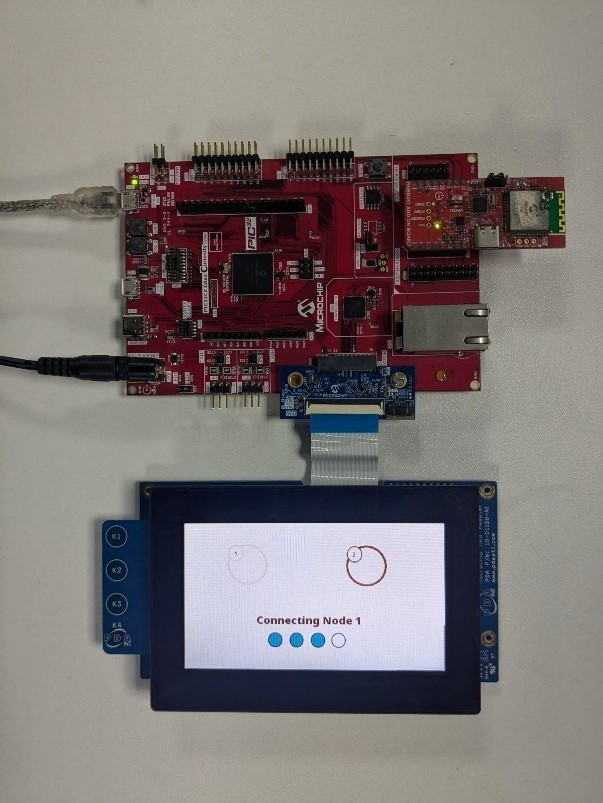
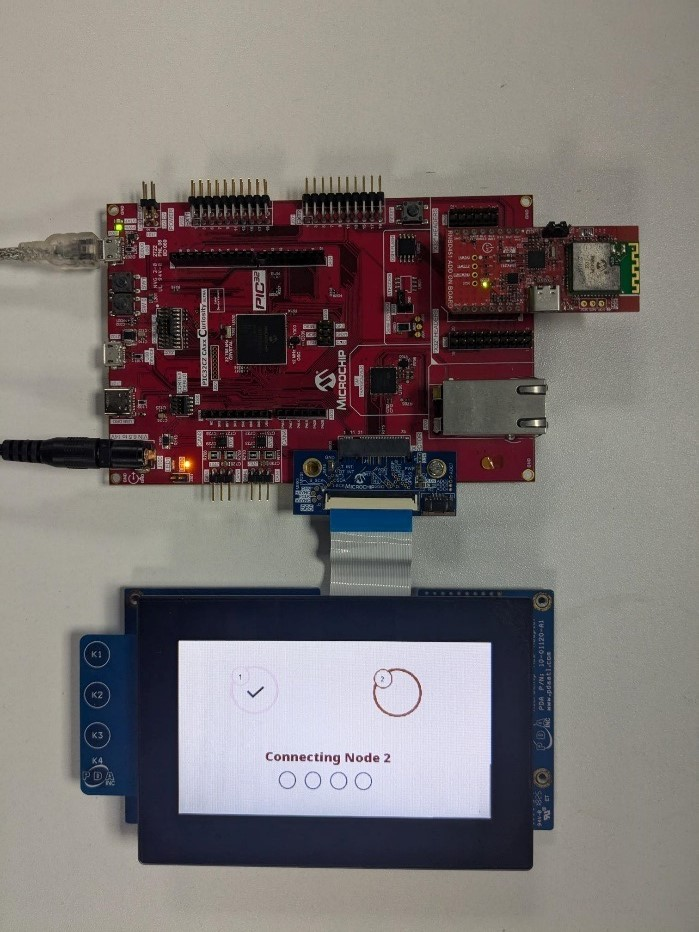
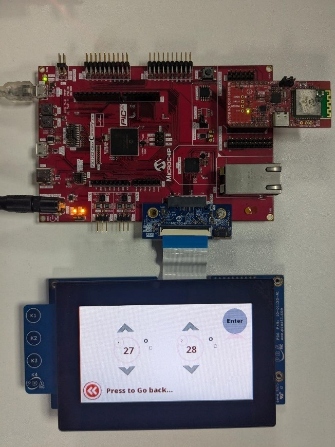
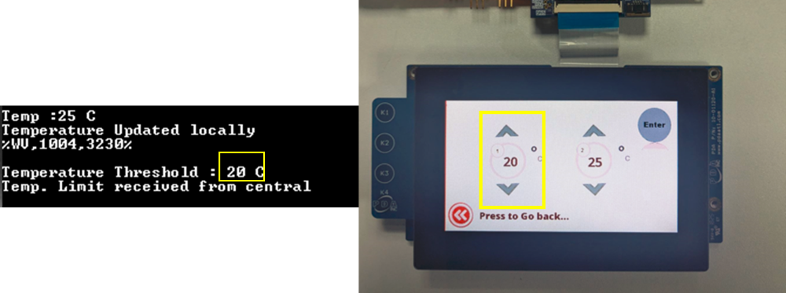
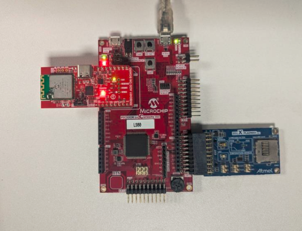

# **Smart Wireless Thermostat on PIC32CZ CA90 Curiosity Ultra Development Board**
<h2 align="center"> <a href="https://github.com/Microchip-MPLAB-Harmony/reference_apps/releases/latest/download/pic32cz_ca90_wireless_thermostat.zip" > Download </a> </h2>

## **Description**

This wireless thermostat application uses Bluetooth Low Energy 5.2 and
Wi-Fi technology to collect real-time temperature data from two BLE
sensor nodes. It allows users to easily set and control the temperature,
creating a pleasant environment by adjusting the heating or cooling
system to their desired level through an intuitive BLE central node
acting as a wireless thermostat that connects to the end nodes over BLE
and acts as the temperature control panel. The collected temperature is
also streamed through the Wi-Fi Gateway node to the AWS IoT cloud for
monitoring.

This solution includes four projects to demonstrate a Wireless Thermostat.

- [**Wireless Thermostat Central Control Panel - (PIC32CZ_CA90 Central BLE
  Node Application**):](./firmware/pic32cz_ca90_cult_wt_central/readme.md)

This project employs the RNBD451 BLE module to create multi-link BLE
connections with two peripheral nodes. Once connected, the central node
functions as a GATT client, periodically requesting real-time
temperature data from the peripheral GATT servers(peripherals) and
displaying it on a 4.3-inch maXTouch graphics display. Users can set
and send temperature threshold limits to the BLE peripheral nodes using
the GUI. Furthermore, the central application transmits the gathered
temperature data to the WFI32 IoT gateway via UART for real-time
monitoring on the AWS cloud.

- [**Wireless Thermostat Peripheral BLE Sensor Node 1 - (PIC32CM_LS60 BLE
  Peripheral Node**):](./firmware/pic32cm_ls60_cpro_wt_node1/readme.md)

This application operates as a GATT server using the RNBD451 BLE module.
It periodically collects temperature data from the IO/1 Xplained Pro
board and updates the temperature characteristic value whenever the
temperature changes. The node waits for the connection request from the
central node. Once connected, it sends temperature data in response to
read requests from the GATT client(central node) and can receive and
implement threshold limit values from the central node. An onboard LED
turns on whenever the temperature exceeds the designated limit.

- [**Wireless Thermostat Peripheral BLE Sensor Node 2 - (WBZ451 BLE Peripheral
  Node**):](./firmware/wbz451_curiosity_wt_node2/readme.md)

This application uses ADC to read the analog output from the onboard
MCP9700A temperature Sensor. Once connected to central node over BLE, it
periodically sends the temperature characteristic value to the central
node upon request. It can also receive and set threshold limit values
from the central node, with an onboard LED illuminating when the
temperature surpasses the defined cutoff

- [**Wireless Thermostat Gateway - (WFI32 IoT WiFi-Gateway**):](./firmware/wfi32_iot_wt_gateway/readme.md)

This application acts as bridge between the central node and the AWS
cloud. It periodically receives the BLE end nodes temperature data from
the central over UART and publishes the same over MQTT to the AWS IoT
cloud for constant monitoring.

## **Modules/Technology Used:**

- For PIC32CZ CA90 [Click Here](./firmware/pic32cz_ca90_cult_wt_central/readme.md)
- For PIC32CM LS60 [Click Here](./firmware/pic32cm_ls60_cpro_wt_node1/readme.md)
- For WBZ451 [Click Here](./firmware/wbz451_curiosity_wt_node2/readme.md)
- For WFI32 IoT [Click Here](./firmware/wfi32_iot_wt_gateway/readme.md)

## Hardware Used:
| Hardware                                                                                                    |  Nos. Required  |
| ------------------------------------------------------------------------------------------------------------| :-------------: |
| [PIC32CZ CA90 Curiosity Ultra Development Board](https://www.microchip.com/en-us/development-tool/ev16w43a) |               1 |
| [PIC32CM LS60 Curiosity Pro Evaluation Kit](https://www.microchip.com/en-us/development-tool/EV76R77A)      |               1 |
| [RNBD451 Add On Board](https://www.microchip.com/en-us/development-tool/ev25f14a)                           |               2 |
| [WBZ451 Curiosity Development Board](https://www.microchip.com/en-us/development-tool/ev96b94a)             |               1 |
| [WFI32 IoT Development Board](https://www.microchip.com/en-us/development-tool/ev36w50a)                    |               1 |
| [I/O1 Xplained Pro Extension Kit](https://www.microchip.com/Developmenttools/ProductDetails/ATIO1-XPRO)     |               1 |
| [4.3” WQVGA maXTouch Display module](https://www.microchip.com/en-us/development-tool/AC320005-4)           |               1 |
| [565 LCD Adapter Graphics Card](https://www.microchip.com/en-us/development-tool/ac320212)                  |               1 |

## **Software/Tools Used:**

The projects have been verified to work with the following versions of software tools:

- **For Central PIC32CZ_CA90 GATT Client**, Refer [Project Manifest](./firmware/pic32cz_ca90_cult_wt_central/src/config/pic32cz_ca90_cult/harmony-manifest-success.yml)
  present in this [path](./firmware/pic32cz_ca90_cult_wt_central/src/config/pic32cz_ca90_cult)

- **For peripheral PIC32CM_LS60 GATT Server** , Refer to the [Secure Project Manifest](./firmware/pic32cm_ls60_cpro_wt_node1_secure/src/config/ls60_cpro/harmony-manifest-success.yml) and [Non-Secure Project Manifest](./firmware/pic32cm_ls60_cpro_wt_node1/src/config/ls60_cpro/harmony-manifest-success.yml)
  present in this [secure](./firmware/pic32cm_ls60_cpro_wt_node1_secure/src/config/ls60_cpro) and [non-secure](./firmware/pic32cm_ls60_cpro_wt_node1/src/config/ls60_cpro) project paths.

- **For peripheral WBZ451 GATT Server**, Refer [Project Manifest](./firmware/wbz451_curiosity_wt_node2/src/config/pic32cxbz2_wbz451_curiosity/harmony-manifest-success.yml)
  present in this [path](./firmware/wbz451_curiosity_wt_node2/src/config/pic32cxbz2_wbz451_curiosity)

- **For Wi-Fi Gateway PIC32MZ_W1 ,** Refer [Project Manifest](./firmware/wfi32_iot_wt_gateway/src/config/wfi32_iot/harmony-manifest-success.yml) present in
  this [path](./firmware/wfi32_iot_wt_gateway/src/config/wfi32_iot)

- [MPLAB® X IDE v6.20](https://www.microchip.com/en-us/tools-resources/develop/mplab-x-ide#tabs)

- [MPLAB® XC32 C/C++ Compiler v4.45](https://www.microchip.com/en-us/tools-resources/develop/mplab-xc-compilers/xc32#downloads)

- Any Serial Terminal application like Tera Term terminal.

- Python 3.5 or higher.

Because Microchip regularly updates tools, occasionally issue(s) could
be discovered while using the newer versions of the tools. If the
project doesn’t seem to work and version incompatibility is suspected,
it is recommended to double-check and use the same versions that the
project was tested with. To download original version of MPLAB® Harmony
v3 packages, refer to document [How to Use the MPLAB® Harmony v3 Project
Manifest
Feature](https://ww1.microchip.com/downloads/en/DeviceDoc/How-to-Use-the-MPLAB-Harmony-v3-Project-Manifest-Feature-DS90003305.pdf)

## **Hardware Setup:**

### **PIC32CZ CA90 Thermostat Central Node:**

- Connect the **565 LCD Adapter Graphics Card** to the "**Graphics connector**" of the **PIC32CZ CA90 Curiosity Ultra Development Board**.

- Connect the **4.3” WQVGA maXTouch Display module** to the **565 LCD Adapter Graphics Card** of the **PIC32CZ CA90 Curiosity Ultra Development Board**. 
  
- Make sure the jumper **J2** of the **RNBD451 Add On Board** 
  has the cap mounted between **J(2-1)** and **J(2-2)** to be powered by the
  mikroBUS header.

- Connect the jumper wire from **PC08** on **EXT1** for **SERCOM UART TX** to
  communicate with the Wi-Fi Gateway. 

- Connect the **PIC32CZ CA90 Curiosity Ultra Development Board** to the **Host PC** as a USB Device through a **Type-A male to micro-B USB** cable connected
  to **Micro-B USB (Debug USB)** port

- Power the **PIC32CZ CA90 Curiosity Ultra Development Board** through the **Barrel connector** using the **wall-mount 9V power supply** provided in the kit, or Power supply with any Voltage (**6.5-14V DC**) and Current (**> 750 mA**) range.

### **PIC32CM LS60 Thermostat Peripheral Node 1:**

- Connect the **RNBD Add-on board** to the **mikroBUS header** on the **PIC32CM
  LS60 Curiosity Pro Evaluation Kit**. 
  
- Make sure the jumper **J2** of the **RNBD451 Add On Board** has the cap mounted between **J(2-1)** and **J(2-2)** to be powered by the mikroBUS header.

<!-- -->

- Connect the **I/O1 Xplained Pro Extension Kit** to the **EXT2** in the **PIC32CM LS60 Curiosity Pro Evaluation Kit.**

- Connect the **PIC32CM LS60 Curiosity Pro Evaluation Kit** to the **Host PC**
  as a USB Device through a **Type-A male to micro-B USB** cable connected
  to **Micro-B USB (Debug USB)** port

### **WBZ451 Thermostat Peripheral Node 2:**

- Connect the **WBZ451 Curiosity board** to the **Host PC** as a USB Device
  through a **Type-A male to micro-B USB** cable connected to **Micro-B Debug USB port(J7)**.

### **WFI32 IoT Thermostat Wi-Fi Gateway:**

- Connect the **WFI32 IoT development board** to the **Host PC** as a USB Device
  through a **Type-A male to micro-B USB** cable connected to **PKOB4 Micro-B USB (Debug USB) (J200)**.

**Demo Hardware Setup:**

 

**Pre-requisites:**

- The WFI32E01PC module on the WFI32 IoT development board has an in-built Trust and
  Go (TNG) device. It is essential to upload the device certificate of
  the TNG device to the AWS IoT cloud for authenticated client TLS
  connection with the cloud platform.

- Please follow the procedure mentioned in [Generate Device
  certificate](https://github.com/MicrochipTech/PIC32MZW1_UARTManifest/blob/main/scripts/manifestProcessing_uart/readme_deviceCertificate.md) for
  extracting the certificate from the device.

- Upon generation, the device certificate should be uploaded to the
  cloud. Refer to the [Uploading Device Certificate to AWS IoT Cloud Service](./firmware/wfi32_iot_wt_gateway/readme.md#uploading-device-certificate-to-aws-iot-cloud-service) for more details about the procedure.

- The [configuration.h](./firmware/wfi32_iot_wt_gateway/src/config/wfi32_iot/configuration.h) file of wfi32_iot.X project should be modified for connecting
  successfully to the AWS cloud. 
  - Ensure that the WIFI SSID and WIFI
  Password is modified in the file by changing the **SYS_WIFI_STA_SSID** and
  **SYS_WIFI_STA_PWD** macros with the Wi-Fi credentials. 
  - Also ensure that the aws endpoint and aws thing name are properly set in the
  **SYS_MQTT_INDEX0_BROKER_NAME** and **SYS_MQTT_INDEX0_CLIENT_ID** macros
  respectively. This depends on user-specific AWS account credentials. For more details check [this page](./firmware/wfi32_iot_wt_gateway/readme.md).

## **Programming Methods:**

- The device can be programmed in two ways

  - Refer Method 1: Programming using the prebuilt hex file.

  - Refer Method 2: Programming by building the application project.

<!-- -->

- Perform Prerequisites mentioned above, if not done already.

### **Method 1: Programming prebuilt hex file:**

- Open MPLAB® X IDE.

- Close all existing projects in IDE, if any project is opened.

- Go to **File -> Import -> Hex/ELF** File.

- In the "**Import Image File**" window, Step 1 - Create Prebuilt Project,
  Click the "**Browse**" button to select the prebuilt hex file.

- Select Device as "**PIC32CZ8110CA90208**"

- Ensure the proper tool is selected under "**Hardware Tool**".

- Click on the "**Next**" button.

- In the "**Import Image File**" window, Step 2 - Select Project Name and
  Folder, select appropriate project name and folder.

- Click on the "**Finish**" button.

- In MPLAB® X IDE, click on "**Make and Program Device**" Button. The device
  gets programmed.

- Follow the steps in [Running the Demo](#running-the-demo) under
  [PIC32CZ CA90 Central](#pic32czca90-ble-central-node) section below.

**Note**: Program the prebuilt hex files for other projects similarly, by choosing the respective devices and tool.

### Method 2: **Programming/Debugging the Application Project:**

#### **PIC32CM LS60 Thermostat Peripheral Node 1**

- Open the project **ls60_cprogroup.X** in MPLAB® X IDE from [here](./firmware/pic32cm_ls60_cpro_wt_node1) and set
  it as main project.

- Open both Secure and Nonsecure projects inside the project group and
  set the Nonsecure project as the main project.

- Ensure "**PIC32CM LS60 Curiosity Pro**" is selected as hardware tool to
  program/debug the application.

- Build the code and program the device by clicking on the "**Make and Program Device**" button in MPLAB® X IDE tool bar.

- Follow the steps in [Running the
  Demo ](#running-the-demo)under [PIC32CM LS60 Peripheral Node ](#pic32cm-ls60-ble-peripheral-node) section below.

#### **WBZ451 Thermostat Peripheral Node 2:**

- Open the project **wbz451_curiosity.X** in MPLAB® X IDE from [here](./firmware/wbz451_curiosity_wt_node2) and set
  it as main project.

- Ensure "**WBZ451 Curiosity board**" is selected as hardware tool to
  program/debug the application

- Build the code and program the device by clicking on the "**Make and Program Device**" button in MPLAB® X IDE tool bar

- Follow the steps in [Running the
  Demo ](#running-the-demo)under [WBZ451 Peripheral Node](#wbz451-ble-peripheral-node) section below
  

#### **PIC32CZ CA90 Thermostat Central Node:**

- Open the project **pic32cz_ca90_cult.X** in MPLAB® X IDE from [here](./firmware/pic32cz_ca90_cult_wt_central) and set
  it as main project.

- Ensure "**PIC32CZ CA90 Curiosity Ultra**" is selected as hardware tool to
  program/debug the application

- Build the code and program the device by clicking on the "**Make and Program Device**" button in MPLAB® X IDE tool bar

- Follow the steps in [Running the
  Demo ](#running-the-demo)under [PIC32CZ CA90
  Central Node](#pic32czca90-ble-central-node) section below.

#### **WFI32 IoT Wi-Fi Thermostat Gateway**

- Open the project **wfi32_iot.X** in MPLAB® X IDE from [here](./firmware/wfi32_iot_wt_gateway) and set
  it as main project.

- Ensure "**WFI32 IoT board**" is selected as hardware tool to program/debug
  the application.

- Build the code and program the device by clicking on the "**Make and Program Device**" button in MPLAB® X IDE tool bar.

- Follow the steps in [Running the Demo ](#running-the-demo)under [WFI32 IoT Gateway](#wfi32-iot-wi-fi-gatway-node) section below.

## **Running the Demo:**

 

### **PIC32CZCA90 BLE Central Node:**

- Power up the board. Ensure the **4.3" WQVGA maXTouch® Display Module** is connected to the 565 LCD Adapter Graphics Card and press "**RESET**" button of the PIC32CZ CA90 Curiosity Ultra Development Board.

### **Screen 1: Home Screen**

- The home screen of the demo gets displayed on the **4.3” WQVGA maXTouch® Display Module**.

> 

>  style="width:300px;height:auto;"
> alt="A red circuit board with a screen and a display Description automatically generated" />

<!--This will set the image's width to 300 pixels while maintaining its original aspect ratio by setting the height to auto.-->

- Make sure that the BLE peripheral nodes, [NODE 1](https://www.microchip.com/en-us/development-tool/EV76R77A) and [NODE 2](https://www.microchip.com/en-us/development-tool/ev96b94a), are programmed with their respective application projects and both the nodes are ready to
  connect to the central node.

> **Note**:Before proceeding to the next step, make sure the console messages shown on the peripheral Node 1 and Node 2 are as 
> [Node 1 Ready Status](#connecting) and [Node 2 Ready Status](#Adv)

- Press the “**START**” button on the home screen.

> 
 
>  style="width:300px;height:auto;" />

### **Screen 2: Multi-Connect Screen**

- The central node starts to scan for the nearby BLE peripheral nodes.
  “**Scanning**” appears on the connect screen. Please wait for a few
  seconds for the BLE scanning process to complete.

- Once the scanning completes, the central initiates connection with BLE
  Node 1. 

> 
  style="width:300px;height:auto;" />

- Upon successful connection with BLE node 1, a tick mark appears on the GUI as
  below and **LED0** is turned on.

> 
  style="width:300px;height:auto;" />

- Similarly , the central node initiates another connection to BLE
  node 2.

- Upon successfully connecting with the second node, a tick mark appears
  on the GUI ,as below, and the next screen appears that shows "**Preparing**" appears.

- **LED0** and **LED1** are turned on with a successful multilink connection on
  the PIC32CZ CA90 Curiosity Ultra Development Board as below

> 
  style="width:300px;height:auto;" />

### **Screen 3: Multi Node Sensor Monitoring**

- This screen gets updated with node 1 and node 2 temperature data
  fetched in periodic intervals from the BLE peripheral devices.

> 
  style="width:300px;height:auto;"
> alt="A red circuit board with a screen and a small display Description automatically generated" />

> **Note**:The corresponding temperature can be viewed on the tera term console of nodes 1 and 2

- Press “Set Limit” button to assign threshold limit for the nodes to
  cutoff the heating or cooling unit. Once Set Limit is pressed the next
  screen appears 

> **Note**:Please wait for a couple of seconds if the next screen doesn't appear immediately.

### **Screen 4: Temperature Control** 

- Temperature limits can be set for each of the nodes using the **‘ᴧ’**
  (Increment) and **‘v’**(Decrement) buttons.

> 
  style="width:300px;height:auto;" />

- To set threshold for node 1, adjust the temperature and press “enter”.

- Similarly, to set threshold for node 2, adjust the temperature for
  node 2 and press “enter”.

> **Note:** Please note that the limits for each node should be set
> individually. The nodes do not get updated simultaneously. To set
> threshold for both the nodes, change the limit in one node, press
> enter and then do the same for the other node.

- Press “**Press to Go back**” to go to screen 3. 

### **PIC32CM LS60 BLE Peripheral Node:**

- Power up the board.

- Open the Terminal application (Ex.:Tera term) on the computer

- Change the baud rate to 115200.

> 
  alt="A screenshot of a computer Description automatically generated" />

- Press "**RESET**" button of the PIC32CM LS60 Curiosity Pro Evaluation Kit to run the application from the beginning.

- The below console output will be displayed. The last message on Tera Term will be “**Connecting**” where the node waits for a BLE connection.

 

- When the central node successfully connects (*after pressing start on
  the central node GUI*), the green **LED0** turns on indicating successful
  connection.

 

- The measured temperature value prints on the console as below

 

- The BLE node also receives the temperature threshold values set on the
  central node as below.

 

- LED1 (Red LED) on PIC32CM LS60 Curiosity Pro Evaluation Kit turns on whenever the current temperature is greater than the set limit.

 

### **WBZ451 BLE Peripheral Node:**

- Power up the board.

- Open the Terminal application (Ex.:Tera term) on the computer

- Change the baud rate to 115200.

- Press RESET button to start over the application.

- The device starts BLE
  advertisement and displays the current temperature in periodic
  intervals

> 
  style="width:5.27848in;height:1.52888in"
> alt="A screen shot of a computer Description automatically generated" />

- Once the connection with the central node is successful, it sends the
  current temperature value to the central node.

> 
 style="width:5.82279in;height:1.02396in"
> alt="A black background with white letters Description automatically generated" />
> 
  style="width:5.8936in;height:2.70886in"
> alt="A black screen with white text Description automatically generated" />

> 
  style="width:6.65764in;height:2.27222in"
> alt="A black background with white text and red line Description   automatically generated" />
  
- The BLE node also receives the temperature threshold values set on the central node

- The RGB LED(**D6**) of the WBZ451 Curiosity Development Board glows in Red when the current temperature exceeds the threshold set. In the above image the current temperature (31°C) is greater than the received threshold (22°C). The LED turns on in this scenario.

 

### **WFI32 IoT Wi-Fi Gateway Node:**

- Power up the board

- Open the Terminal application (Ex.:Tera term) on the computer

- Change the baud rate to 115200 from Setup->Serial menu.

> 
  style="width:3.3494in;height:3.2323in"
> alt="A screenshot of a computer Description automatically generated" />

- Press "**RESET**" button to run the application from the beginning.

- The console displays TCP/IP stack initialization messages and the
  Gateway IP address gets assigned and displayed on successful
  connection with Wi-Fi AP. Wait for some time for the MQTT connection
  establishment as it may take some time.

> 
  style="width:5.29484in;height:1.40177in" />

- Once the MQTT connection is established the device is ready to update
  the temperature received from the central node in AWS cloud
  periodically.

- The device starts to publish the messages when [the central node
  updates the temperature](#screen-3-multi-node-sensor-monitoring)

> 
  style="width:5.44876in;height:2.83499in" />

- To view the messages published, log in to the AWS account and navigate to the **AWS IoT Core service -\> MQTT Test client**, and subscribe to
  **/pubTopic/**. Furthermore, the following messages will be displayed:

> 
  style="width:4.58397in;height:2.59411in"
> alt="A screenshot of a computer Description automatically generated" />

## Comments:

- [Getting Started Extended Application on PIC32CZ CA90 Curiosity Ultra Development Board](https://microchip-mplab-harmony.github.io/reference_apps/apps/pic32cz_ca90_cult/pic32cz_ca90_getting_started_ext/readme.html)
- [Creating the First Application on PIC32CZ CAx Microcontrollers Using MPLAB® Harmony v3 with MPLAB® Code Configurator (MCC)](https://ww1.microchip.com/downloads/aemDocuments/documents/MCU32/ProductDocuments/SupportingCollateral/Creating-the-First-Application-on-PIC32CZ-CAx-Microcontrollers-Using-MPLAB-Harmony-v3-with-MPLAB-Code-Configurator-DS90003348.pdf)
- [Getting Started with the PIC32CM LE00/LS00/LS60 Curiosity Pro Board](https://ww1.microchip.com/downloads/aemDocuments/documents/MCU32/ApplicationNotes/ApplicationNotes/AN4511-Getting-Started-with-the-PIC32CM-LE00-LS00-LS60-Curiosity-Pro-Board-DS00004511.pdf)
- Reference Document: [PIC32CM LS00/LS60 Security Reference Guide](https://ww1.microchip.com/downloads/aemDocuments/documents/MCU32/ApplicationNotes/ApplicationNotes/AN3992-PIC32CM-LS00-LS60-Security-Reference-Guide-DS00003992.pdf)
- [PIC32CXBZ2 Application Developer's Guide](https://onlinedocs.microchip.com/oxy/GUID-A5330D3A-9F51-4A26-B71D-8503A493DF9C-en-US-7/GUID-7663617B-0DD1-45FA-86B5-EB0778A5A424.html)
- [PIC32CXBZ2 - MPLAB Harmony Wireless BLE Userguide](https://onlinedocs.microchip.com/oxy/GUID-C5EAF60E-9124-427C-A0F1-F2DBE662EA92-en-US-3/index.html)
- [PIC32CXBZ2-Programming specification](https://ww1.microchip.com/downloads/aemDocuments/documents/WSG/ProductDocuments/ProgrammingSpecifications/PIC32CX-BZ2-Programming-Specification-DS70005461.pdf)
- This application demo builds and works out of box by following the instructions above in [Running the Demo ](#running-the-demo)section. If there is a need to enhance or customize this application demo, use the MPLAB® Harmony v3 Software framework. Refer to the links below to set up and build the applications using MPLAB® Harmony v3.
	- [How to Setup MPLAB Harmony v3 Software Development Framework](https://ww1.microchip.com/downloads/aemDocuments/documents/MCU32/ProductDocuments/SupportingCollateral/How-to-Setup-MPLAB-Harmony-v3-Software-Development-Framework-DS90003232.pdf)	
	- [Video - How to Set up the Tools Required to Get Started with MPLAB® Harmony v3 and MCC](https://www.youtube.com/watch?v=0rNFSlsVwVw)	
	- [Create a new MPLAB Harmony v3 project using MCC](https://developerhelp.microchip.com/xwiki/bin/view/software-tools/harmony/getting-started-training-module-using-mcc/)
	- [Update and Configure an Existing MHC-based MPLAB Harmony v3 Project to MCC-based Project](https://developerhelp.microchip.com/xwiki/bin/view/software-tools/harmony/update-and-configure-existing-mhc-proj-to-mcc-proj/)
	- [How to Build an Application by Adding a New PLIB, Driver, or Middleware to an Existing MPLAB Harmony v3 Project](https://ww1.microchip.com/downloads/aemDocuments/documents/MCU32/ProductDocuments/SupportingCollateral/How-to-Build-an-Application-by-Adding-a-New-PLIB-Driver-or-Middleware-to-an-Existing-MPLAB-Harmony-v3-Project-DS90003253.pdf)	

## Revision:
- v1.7.0 - Released demo application